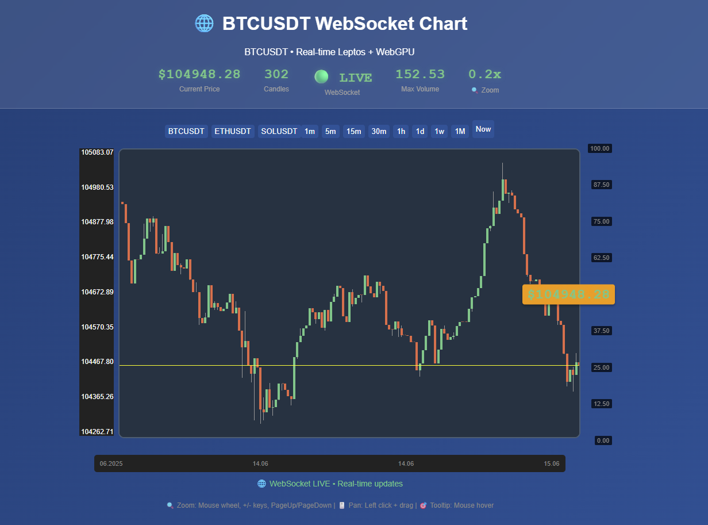

# WebGPU Candles



A demonstration Bitcoin candlestick chart built with **WebGPU** for rendering and **Leptos** for the reactive UI. Real-time price data is streamed from Binance via WebSocket and drawn directly to a `<canvas>` using Rust compiled to WebAssembly.
The chart supports zoom levels from roughly `0.2x` up to `32x` with a minimum of one visible candle.
The project requires the `wasm32-unknown-unknown` target, which the build script verifies is installed. Install it with:
`rustup target add wasm32-unknown-unknown`.

## Setup

```bash
# Add the WebAssembly compilation target
rustup target add wasm32-unknown-unknown
# Install Trunk for building and serving
cargo install trunk
```

Install either [Trunk](https://trunkrs.dev/) or [wasm-pack](https://rustwasm.github.io/wasm-pack/) depending on your preferred workflow.

To automatically format and lint the code before each commit, enable the pre-commit hook:

```bash
git config core.hooksPath githooks
```

## Building with Trunk

Trunk compiles the project and automatically injects the generated WASM into `index.html`:

```bash
trunk serve       # dev server on http://localhost:8080
# or
trunk build --dist dist-local
```

Local builds are saved to `dist-local`. In GitHub Actions the `dist` path is
used and the files are copied to [`docs/`](docs/) to publish the demo.
The `docs/version` file stores the SHA of the last commit.

When using Trunk, open **`index.html`** (served automatically when using `trunk serve`). The file contains a Trunk hook so the WASM is loaded for you:

```html
<!-- Trunk will automatically inject the WASM here -->
<link data-trunk rel="rust" data-wasm-opt="z" />
```

## Building with wasm-pack

Alternatively, you can build using wasm-pack:

```bash
wasm-pack build --target web --release
```

This produces a `pkg/` directory with the compiled `price_chart_wasm.js`. After running wasm-pack, open **`leptos-index.html`**, which manually imports the generated file:

```html
<script type="module">
    import init, { hydrate } from './pkg/price_chart_wasm.js';
    // ...
</script>
```

## Directory Structure

Key folders are under `src/`:

```text
src/
├── app.rs                  # Leptos UI components and reactivity
├── lib.rs                  # WASM exports (entry points)
├── simple_shader.wgsl      # WebGPU shaders
├── domain/                 # Core domain logic (chart, market data, logging)
├── infrastructure/         # WebSocket and WebGPU renderer implementations
```

For more architectural details see [ARCHITECTURE.md](DOCS/ARCHITECTURE.md).
Planned features are listed in [FEATURES.md](DOCS/FEATURES.md).
Details on the WebSocket feed are in [WEBSOCKETS.md](DOCS/WEBSOCKETS.md).

## Documentation

All additional documentation lives in the [`DOCS/`](DOCS/) directory:

- [ARCHITECTURE.md](DOCS/ARCHITECTURE.md)
- [FEATURES.md](DOCS/FEATURES.md)
- [WEBSOCKETS.md](DOCS/WEBSOCKETS.md)
- [CONTRIBUTING.md](DOCS/CONTRIBUTING.md)
- [PERFORMANCE.md](DOCS/PERFORMANCE.md)
- [TESTS.md](DOCS/TESTS.md)
- [VOLUME_SYNC_FIXES.md](DOCS/VOLUME_SYNC_FIXES.md)
- [COLORS.md](DOCS/COLORS.md)

## Chart Elements

The chart is composed of several layers:

- Candles with wicks representing OHLC data
- Volume bars below the main chart
- Time and price grid lines
- A highlighted line for the current price
- Technical indicators:
  - Simple Moving Averages (20, 50, 200 periods)
  - Exponential Moving Averages (12, 26 periods)
  - Ichimoku cloud with Tenkan, Kijun, Senkou spans and Chikou line

## Demo

The latest static build is generated by GitHub Actions and available at
<https://qqrm.github.io/webgpu-candles/>. The files are published to the
[`docs/`](docs/) directory.

## Benchmarks

To measure performance use:

```bash
wasm-pack test --headless --chrome
```

FPS is printed to the console and the `perf.yml` workflow saves the log as an
artifact. Current metric values are stored in [docs/perf.md](docs/perf.md).
`tests/performance_limit.rs` logs when FPS drops below 30 for large charts.


## Tests

The tests use [`wasm-bindgen-test`](https://docs.rs/wasm-bindgen-test). Run
them with:

```bash
wasm-pack test
```

Alternatively install Node dependencies and run:

```bash
npm install
npm test
```

See [TESTS.md](DOCS/TESTS.md) for more details about the test suite.

Coverage can be collected with `cargo-llvm-cov`:

```bash
cargo llvm-cov --workspace --lcov --output-path lcov.info --target wasm32-unknown-unknown -Z build-std=std,panic_abort
```
Make sure the `rust-src` component is installed before running the command.

The generated `lcov.info` file can be uploaded by CI.
The `coverage` workflow publishes the latest percentage to `docs/coverage.md`.
## Docker

Build and run the container with:
```bash
docker build -t webgpu-candles .
docker run --rm -p 8080:80 webgpu-candles
```
(the container uses nginx, so port 80 is mapped to host 8080).


## License
This project is distributed under the [MIT License](LICENSE).

