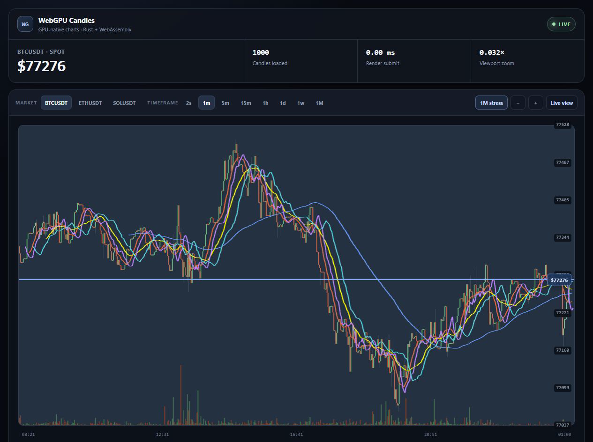

# WebGPU Candles



An interactive spot-market candlestick chart rendered with WebGPU in Rust/WebAssembly. The Leptos UI combines Binance REST history with live WebSocket updates and keeps supported markets ready for instant switching.

## Demo

- [Release](https://qqrm.github.io/webgpu-candles/)
- [Development build](https://qqrm.github.io/webgpu-candles/dev/)

Use a browser with WebGPU enabled. Chromium-based browsers such as Chrome and Microsoft Edge are the tested targets.

## Features

- BTCUSDT, ETHUSDT, and SOLUSDT spot markets, with a live stream kept open for each market.
- Timeframes from two seconds to one month: `2s`, `1m`, `5m`, `15m`, `1h`, `1d`, `1w`, and `1M`. The two-second view aggregates Binance one-second candles.
- REST backfill when panning to the oldest loaded candle, plus live updates at the current edge.
- Mouse-wheel and button zoom, drag-to-pan, double-click reset, price and time scales, OHLCV tooltip, volume bars, and a current-price marker.
- Toggleable SMA 20/50/200 and EMA 12/26 overlays.
- A deterministic one-million-candle stress mode. It keeps the source data resident while limiting the rendered OHLCV level of detail to 4,096 GPU bars.

## Requirements

- Rust stable and the `wasm32-unknown-unknown` target.
- [Trunk](https://trunkrs.dev/) for local builds and serving.
- A WebGPU-capable browser for the application and Chromium for browser tests.

```bash
rustup target add wasm32-unknown-unknown
cargo install trunk --locked
```

## Run locally

```bash
trunk serve
```

Open <http://127.0.0.1:8080>. To produce a local release bundle without changing the deployment directory:

```bash
trunk build --release --dist dist-local
```

The CI deployment builds `dist/` and publishes it to GitHub Pages.

## Test

```bash
# Native unit and integration tests
cargo test

# Deterministic browser end-to-end suite
npx playwright install chromium
npm run test:e2e
```

The end-to-end suite builds a release bundle, mocks Binance REST and WebSocket responses, and covers market switching, timeframe changes, zooming, panning, history loading, and the one-million-candle mode. Failure traces, screenshots, and the HTML report are written to `test-results/` and `playwright-report/`.

Browser-targeted Rust tests can also be run with [wasm-pack](https://rustwasm.github.io/wasm-pack/):

```bash
wasm-pack test --chrome --headless
```

## Project layout

```text
src/
├── app.rs                  # Leptos UI and interactions
├── domain/                 # Chart and market-data domain logic
├── ecs/                    # Chart update systems
└── infrastructure/         # Binance clients and WebGPU renderer
```

## Documentation

- [Architecture](DOCS/ARCHITECTURE.md)
- [Features](DOCS/FEATURES.md)
- [WebSocket integration](DOCS/WEBSOCKETS.md)
- [Tests](DOCS/TESTS.md)
- [CI pipelines](DOCS/PIPELINES.md)
- [Contributing](DOCS/CONTRIBUTING.md)
- [Color palette](DOCS/COLORS.md)

## License

Distributed under the [MIT License](LICENSE).
